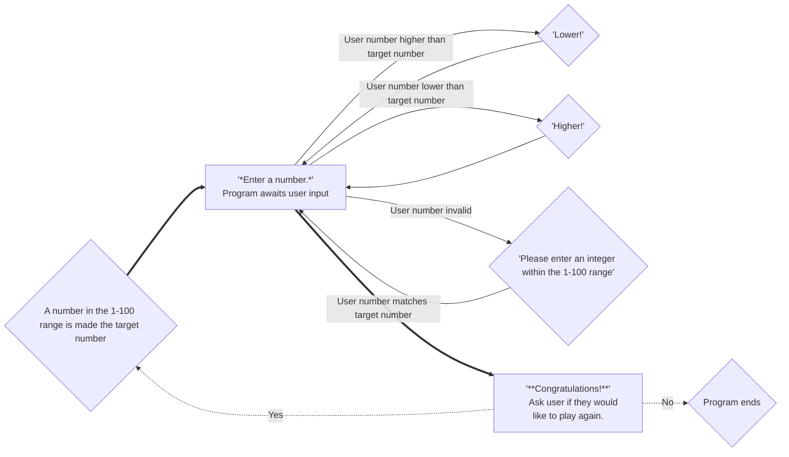

## Description
Rhombus shaped nodes are used when the step does not require user input, while square nodes are used for the steps that do.

Prior to the game beginning, the program pulls a random number from the 1-100 range, and that number becomes the number that the user is to guess.
The program will then prompt the user to  enter a number 1-100.
If the input is invalid, the program will show the user an error message and return back to the entry prompt.
If the inputted number is lower than the correct number, the user will be told to guess higher, and the program will return to the entry prompt.
If the inputted number is higher than the correct number, the user will be told to guess lower, and the program will return to the entry prompt.
If the inputted number matches the correct number, the user will be congratulated and asked if they want to play again.
If they select yes, the program repeats these steps until the user wins again.
If they select no, the program ends.
